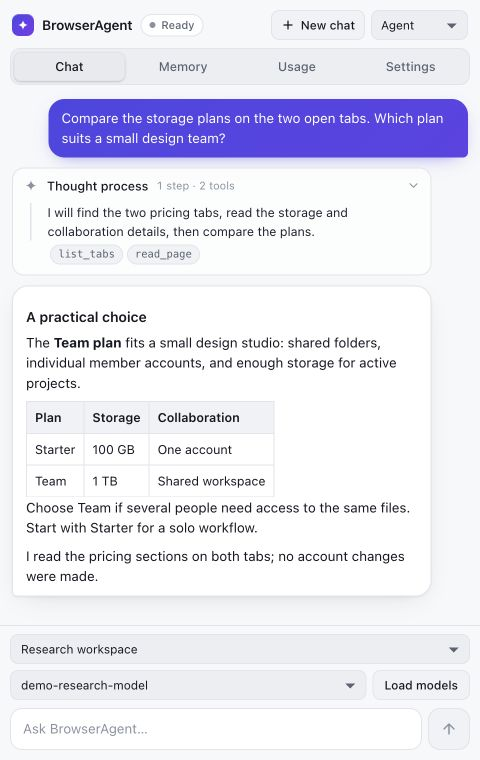
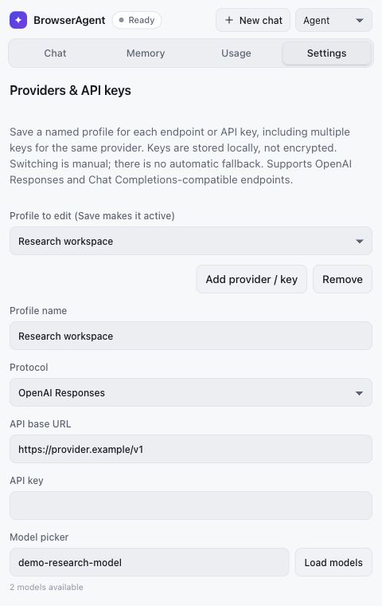
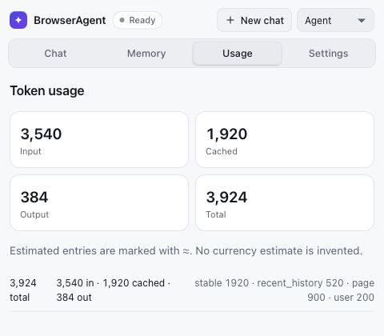

<div align="center">


# BrowserAgent

**Bring your AI into the browser.**

A Firefox sidebar agent for researching pages, working across tabs, and completing forms through your own AI provider.


[Features](#features) · [Screenshots](#screenshots) · [Quick start](#quick-start) · [Development](#development)



</div>

---

BrowserAgent keeps conversation, browser actions, and token usage together in a persistent sidebar. Connect an endpoint that supports OpenAI Responses or Chat Completions, select a model, and choose how closely you want to approve browser actions.

## Features

| Feature | What it does |
|---|---|
| **Conversation beside your pages** | Stream responses, review collapsible model progress, and return to a conversation saved in IndexedDB. |
| **Browser work across tabs** | Read selected page content, find controls, navigate, and fill supported forms using a fixed catalog of browser tools. |
| **Your providers and keys** | Save up to 50 named profiles, load available models, test endpoint capabilities, and switch profiles or models while idle. |
| **Visible context budgets** | Inspect request and run token totals, cached input, compaction, and estimates for context segments. |
| **Workspace memory** | Keep bounded notes with source references; start a new chat to clear the conversation and its workspace memory. |
| **Action policies** | Interactive and Agent modes enforce confirmations outside the model. Stop cancels the current run. |

Page text is read on demand. BrowserAgent has no backend, telemetry, or analytics service; model requests go to the configured provider.

## Screenshots

<table align="center" width="680">
  <tr>
    <td width="50%" align="center" valign="top"><br><sub>Configure a provider and model</sub></td>
    <td width="50%" align="center" valign="top"><br><sub>Inspect token usage and context budgets</sub></td>
  </tr>
</table>

Screenshots show the production sidebar interface with demo conversation and usage data. No live provider credentials are used.

## Quick start

**Requirements:** Node.js 20+ and Firefox 140+.

```sh
npm ci
npm run build
```

1. Open `about:debugging#/runtime/this-firefox` in Firefox.
2. Choose **Load Temporary Add-on** and select `dist/manifest.json`.
3. Click the toolbar action to open the **BrowserAgent** sidebar.
4. Open **Settings**, choose Responses or Chat Completions, and enter the endpoint base URL and optional bearer key.
5. Set the context window and output reserve. Use **Load models** or enter a model ID manually.
6. Click **Test**, approve access to the provider origin, then **Save**.
7. Grant optional website access when prompted and start a conversation.

Temporary add-ons are removed when Firefox closes. Create the packaged extension with `npm run package`; artifacts are written to `web-ext-artifacts/`.

## Providers and profiles

Choose **Add provider / key** to save another named configuration. Each profile has its own key, model, token budget, and tested capabilities. The provider and model dropdowns above chat switch the selected configuration while idle.

Settings changes are drafts until **Save**. To delete a profile, choose **Remove**, then **Save**. Only the active profile's credential is used; there is no automatic key rotation or provider fallback.

API keys are stored in Firefox local extension storage **without encryption**. Switching providers sends the conversation's selected context to the new provider, so start a new chat when you want a separate conversation. Provider requests omit cookies and reject redirects. Native Anthropic and Gemini wire formats are not supported.

## Action modes

| Mode | Behavior |
|---|---|
| **Interactive** | Confirms every browser mutation |
| **Agent** | Confirms submissions, non-navigation controls, tab closure, and unclear effects |
| **YOLO** | Explicit opt-in for actions without confirmation; lasts only for the current browser session |

All modes still enforce supported URLs, schemas, target checks, privacy filters, and configured budgets. Stop interrupts streams, pending confirmations, and page waits. An already-dispatched mutation can remain unverified; inspect its outcome before retrying.

## Browser tools and limits

The agent has 17 browser tools: tab listing and navigation, page reading, frame discovery, waiting, history and bookmark search, and supported click/fill/select/check/submit actions. Page results are bounded and paginated, and controls use revision-bound handles so stale targets require a fresh read.

Rich text editors, multi-selects, closed shadow roots, file uploads/downloads, and interactions requiring trusted hardware events are outside the supported tool set. The model cannot execute arbitrary JavaScript.

See [token policy and browser tools](docs/TECHNICAL.md) for exact defaults, the complete tool catalog, and run-limit behavior. See [ARCHITECTURE.md](ARCHITECTURE.md) for the execution and prompt model.

## Development

| Command | Purpose |
|---|---|
| `npm run typecheck` | Strict TypeScript checks |
| `npm run lint` | ESLint |
| `npm run format` | Formatting check |
| `npm test` | Offline unit and integration tests |
| `npm run test:coverage` | Coverage and thresholds |
| `npm run token:budgets` | Stable-prefix token counts |
| `npm run lint:addon` | Firefox add-on validation |
| `npm run test:e2e` | Packaged Firefox persistence and DOM interaction tests |
| `npm run check` | Complete local verification except packaged E2E |
| `npm run package` | Build the Firefox ZIP |

## License

[MIT](LICENSE).
